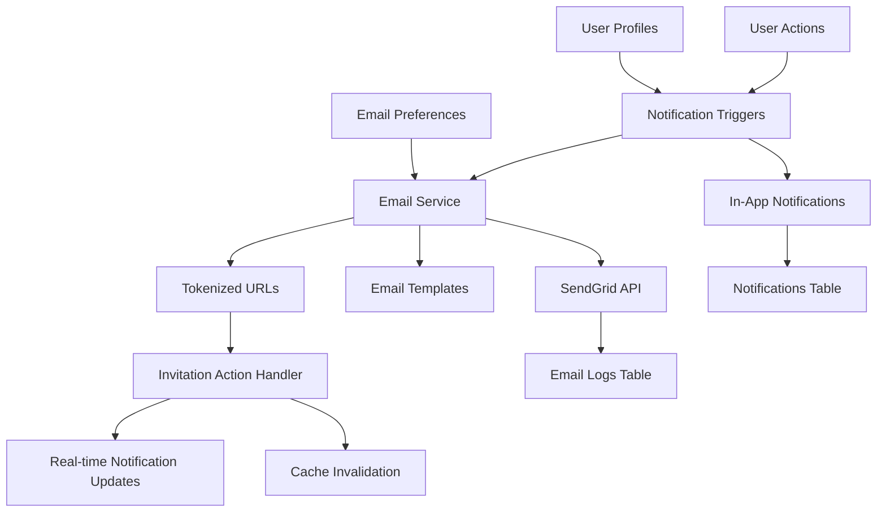

# 📧 Thirstee Email Trigger Notifications Architecture

**Single Source of Truth for Email Notification System**

---

## 🏗️ Core Architecture Overview



### Core Components

1. **Database Layer** - Supabase tables and functions
2. **Edge Functions** - Supabase functions for email processing
3. **Service Layer** - TypeScript services for business logic
4. **UI Layer** - React components for email preferences and notifications
5. **Email System** - SendGrid integration with dark-mode templates
6. **Token System** - Secure tokenized URLs for email actions

---

## 🗄️ Database Schema

### Email Logs Table
```sql
CREATE TABLE email_logs (
  id UUID DEFAULT gen_random_uuid() PRIMARY KEY,
  recipient TEXT NOT NULL,
  subject TEXT NOT NULL,
  type TEXT NOT NULL CHECK (type IN (
    'event_invitation', 'event_reminder', 'crew_invitation', 
    'welcome', 'password_reset'
  )),
  status TEXT NOT NULL DEFAULT 'pending' CHECK (status IN (
    'pending', 'sent', 'failed', 'bounced'
  )),
  message_id TEXT,
  data JSONB,
  error_message TEXT,
  sent_at TIMESTAMPTZ,
  created_at TIMESTAMPTZ DEFAULT NOW(),
  updated_at TIMESTAMPTZ DEFAULT NOW()
);
```

### Email Preferences Table
```sql
CREATE TABLE email_preferences (
  id UUID DEFAULT gen_random_uuid() PRIMARY KEY,
  user_id UUID NOT NULL REFERENCES auth.users(id) ON DELETE CASCADE,
  event_invitations BOOLEAN DEFAULT true,
  event_reminders BOOLEAN DEFAULT true,
  crew_invitations BOOLEAN DEFAULT true,
  marketing_emails BOOLEAN DEFAULT false,
  email_frequency TEXT DEFAULT 'immediate' CHECK (email_frequency IN (
    'immediate', 'daily', 'weekly', 'never'
  )),
  created_at TIMESTAMPTZ DEFAULT NOW(),
  updated_at TIMESTAMPTZ DEFAULT NOW(),
  UNIQUE(user_id)
);
```

### Invitation Tokens Table
```sql
CREATE TABLE invitation_tokens (
  id UUID DEFAULT gen_random_uuid() PRIMARY KEY,
  token TEXT NOT NULL UNIQUE,
  invitation_type TEXT NOT NULL CHECK (invitation_type IN ('event', 'crew')),
  invitation_id TEXT NOT NULL,
  action TEXT NOT NULL CHECK (action IN ('accept', 'decline')),
  user_id UUID NOT NULL REFERENCES auth.users(id) ON DELETE CASCADE,
  expires_at TIMESTAMPTZ NOT NULL,
  used BOOLEAN DEFAULT false,
  created_at TIMESTAMPTZ DEFAULT NOW(),
  updated_at TIMESTAMPTZ DEFAULT NOW()
);
```

---

## ⚡ Edge Functions

### 1. Send Email Function
**Location**: `supabase/functions/send-email/index.ts`

**Purpose**: Handles all email sending via SendGrid API

**Key Features**:
- Email logging to database
- Status tracking (pending/sent/failed/bounced)
- Click tracking disabled for tokenized URLs
- Error handling and retry logic
- CORS support for frontend calls

**Environment Variables**:
```env
SENDGRID_API_KEY=your_sendgrid_key
EMAIL_FROM_ADDRESS=noreply@thirstee.app
EMAIL_FROM_NAME=Thirstee
SUPABASE_URL=your_supabase_url
SUPABASE_SERVICE_ROLE_KEY=your_service_key
```

### 2. Process Event Invitation Token
**Location**: Database function `process_event_invitation_token()`

**Purpose**: Handles Accept/Decline actions from email links via RPC calls

**Flow**:
1. Validate token (not expired, not used)
2. Process invitation response
3. Update notification status
4. Mark token as used
5. Return success/redirect info

### 3. Process Crew Invitation Token
**Location**: Database function `process_crew_invitation_token()`

**Purpose**: Handles crew invitation responses from email links via RPC calls

**Similar flow to event invitations with crew-specific logic**

---

## 📨 Email Templates & Design System

### Template Structure
**Location**: `frontend/src/lib/emailTemplates.ts`

**Design Tokens**:
- `--bg-base: #08090A` - Main background
- `--bg-glass: rgba(255,255,255,0.05)` - Glass containers
- `--text-primary: #FFFFFF` - Primary text
- `--text-secondary: #B3B3B3` - Secondary text
- Max-width: 600px for mobile responsiveness
- Glassmorphism cards with rounded-xl borders

### Email Types

#### 1. Event Invitation Email
```typescript
interface EventInvitationData {
  inviterName: string
  eventTitle: string
  eventDate: string
  eventTime: string
  eventLocation: string
  eventDescription?: string
  duration?: string
  vibe?: string
  acceptUrl: string
  declineUrl: string
  eventUrl: string
}
```

#### 2. Event Reminder Email
```typescript
interface EventReminderData {
  eventTitle: string
  eventDate: string
  eventTime: string
  eventLocation: string
  eventUrl: string
  attendeeCount: number
}
```

#### 3. Crew Invitation Email
```typescript
interface CrewInvitationData {
  inviterName: string
  crewName: string
  crewDescription?: string
  memberCount: number
  acceptUrl: string
  declineUrl: string
  crewUrl: string
}
```

---

## 🔗 Tokenized URL System

### Token Generation
**Service**: `frontend/src/lib/invitationTokenService.ts`

**Security Features**:
- UUID-based secure tokens
- Time-limited expiration (48 hours default)
- Single-use tokens
- Action-specific tokens (accept/decline)

**URL Structure**:
```
https://thirstee.app/invitation/event/accept/{token}
https://thirstee.app/invitation/event/decline/{token}
https://thirstee.app/invitation/crew/accept/{token}
https://thirstee.app/invitation/crew/decline/{token}
```

### Token Validation Flow
1. User clicks email button
2. Redirected to `/invitation/:type/:action/:token`
3. `InvitationAction` component validates token
4. Processes action via Edge Function
5. Updates notifications in real-time
6. Redirects to relevant page

---

## 🔄 Real-time Notification Integration

### Email-to-App Connection

When users click Accept/Decline in emails:

1. **Token Processing**: Edge function validates and processes action
2. **Notification Update**: Updates notification with user response
3. **Cache Invalidation**: Clears relevant caches
4. **Real-time Sync**: NotificationBell component reflects changes immediately

### Cache Strategy
**Service**: `frontend/src/lib/cacheService.ts`

**Cache Keys**:
- `user_notifications_{userId}` - User's notifications
- `unread_count_{userId}` - Unread notification count
- `event_detail_{eventId}` - Event details
- `event_attendance_{eventId}_{userId}` - User attendance status

**TTL**: 60 seconds for notifications

### Notification Bell Integration
**Component**: `frontend/src/components/NotificationBell.tsx`

**Real-time Features**:
- Immediate UI updates after email actions
- Cache invalidation on response
- Optimistic UI updates
- Toast notifications for feedback

---

## 📋 Current Email Trigger Types

### Implemented Triggers

| Type | Description | Template | Actions |
|------|-------------|----------|---------|
| `event_invitation` | User invited to event | Event Invitation | Accept/Decline |
| `event_reminder` | Event starting in 1 hour | Event Reminder | View Event |
| `crew_invitation` | Invited to join crew | Crew Invitation | Accept/Decline |
| `crew_promotion` | Promoted to co-host | Notification only | View Crew |
| `welcome` | New user signup | Welcome Email | Get Started |

### Trigger Functions
**Location**: `frontend/src/lib/notificationService.ts`

```typescript
export const notificationTriggers = {
  async onEventInvitation(eventId: string, inviterId: string, inviteeId: string): Promise<void>
  async onEventReminder(eventId: string, attendeeIds: string[]): Promise<void>
  async onCrewInvitation(crewId: string, inviterId: string, inviteeId: string): Promise<void>
  async onCrewPromotion(crewId: string, promoterId: string, promoteeId: string): Promise<void>
}
```

---

## 🚀 Future Email Trigger Types

### Planned Implementations

1. **Event Reminders**
   - 1 hour before event
   - Day before event
   - Event starting now

2. **Weekly Digest**
   - Crew activity summary
   - Upcoming events
   - Social highlights

3. **Location-based**
   - Nearby events
   - Popular venues
   - Location-specific invites

4. **Social Activity**
   - Friend requests
   - Profile mentions
   - Achievement notifications

5. **Marketing & Engagement**
   - Feature announcements
   - App updates
   - Re-engagement campaigns

---

## 🛠️ Technical Implementation

### Email Service Usage
```typescript
import { sendEventInvitationEmail } from '@/lib/emailService'

const result = await sendEventInvitationEmail({
  to: 'user@example.com',
  inviterName: 'John Doe',
  eventTitle: 'Friday Night Drinks',
  eventDate: '2025-01-10',
  eventTime: '7:00 PM',
  eventLocation: 'The Local Bar',
  acceptUrl: 'https://thirstee.app/invitation/event/accept/token123',
  declineUrl: 'https://thirstee.app/invitation/event/decline/token456',
  eventUrl: 'https://thirstee.app/event/123'
})
```

### Creating Notifications with Email
```typescript
// Create in-app notification
await notificationTriggers.onEventInvitation(eventId, inviterId, inviteeId)

// Send email notification
await sendEventInvitationEmail(emailData)
```

---

## 🎛️ User Preference Management

### Email Preferences Component
**Location**: `frontend/src/components/EmailPreferences.tsx`

**Features**:
- Toggle email types on/off
- Email frequency settings
- Real-time preference updates
- Glassmorphism design integration

### Preference Types
- Event invitations
- Event reminders  
- Crew invitations
- Marketing emails
- Email frequency (immediate/daily/weekly/never)

---

## 📊 Monitoring & Analytics

### Email Delivery Tracking
- SendGrid delivery status
- Open rate tracking (enabled)
- Click tracking (disabled for security)
- Bounce and spam reporting

### Error Handling
- Failed email logging
- Retry mechanisms
- Fallback notifications
- User feedback systems

### Performance Metrics
- Email delivery time
- Token validation success rate
- Cache hit/miss ratios
- Real-time sync performance

---

## 🔒 Security Considerations

### Token Security
- Time-limited expiration
- Single-use tokens
- Secure random generation
- Action-specific validation

### Email Security
- Click tracking disabled
- Tokenized URLs only
- No sensitive data in emails
- Secure token cleanup

### Privacy Compliance
- User preference respect
- Opt-out mechanisms
- Data retention policies
- GDPR compliance ready

---

## 🧪 Testing Strategy

### Email Template Testing
- Visual regression testing
- Cross-client compatibility
- Mobile responsiveness
- Dark mode consistency

### Integration Testing
- Token generation/validation
- Email-to-notification sync
- Cache invalidation
- Real-time updates

### Load Testing
- High-volume email sending
- Concurrent token processing
- Cache performance
- Database connection limits

---

## 📚 Development Guidelines

### Adding New Email Types
1. Define email template interface
2. Create template function
3. Add to email service
4. Update trigger functions
5. Add preference options
6. Test end-to-end flow

### Email Template Standards
- Use design system tokens
- Mobile-first responsive
- Accessible color contrast
- Clear call-to-action buttons
- Consistent branding

### Performance Best Practices
- Batch email sending
- Efficient cache usage
- Minimal database queries
- Optimistic UI updates
- Error boundary handling

---

*Last Updated: January 2025*
*Maintainer: Thirstee Development Team*
