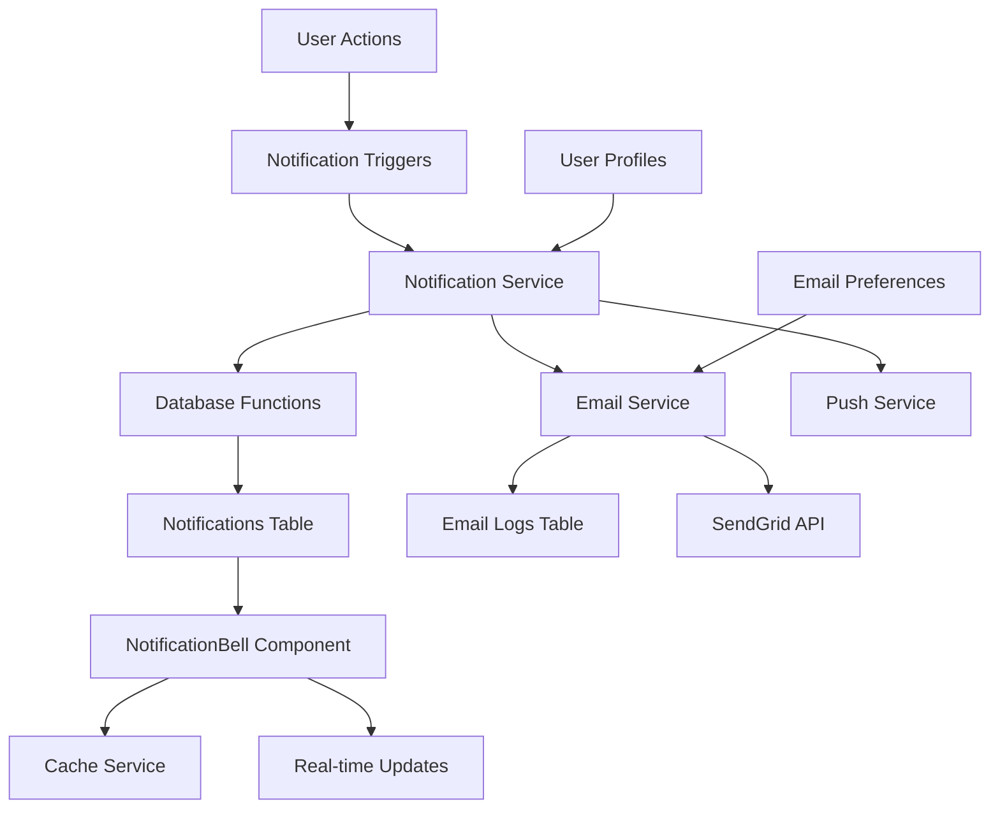

# Thirstee Notification System Architecture

## Overview

The Thirstee notification system is a comprehensive, multi-channel notification platform that handles in-app notifications, email notifications, and push notifications. It's built with a focus on real-time user engagement, proper state management, and scalable architecture patterns.

## System Architecture

### High-Level Architecture



### Core Components

1. **Database Layer** - Supabase tables and functions
2. **Service Layer** - TypeScript services for business logic
3. **UI Layer** - React components for notification display
4. **Email System** - SendGrid integration with templates
5. **Caching Layer** - Multi-level caching for performance

## Database Schema

### Notifications Table

```sql
CREATE TABLE notifications (
  id UUID DEFAULT gen_random_uuid() PRIMARY KEY,
  user_id UUID NOT NULL REFERENCES auth.users(id) ON DELETE CASCADE,
  type TEXT NOT NULL CHECK (type IN (
    'event_invitation', 'event_update', 'crew_invitation', 'event_rsvp',
    'event_reminder', 'crew_invite_accepted', 'event_cancelled',
    'event_rating_reminder', 'event_invitation_response', 'crew_promotion',
    'crew_invitation_response'
  )),
  title TEXT NOT NULL,
  message TEXT NOT NULL,
  data JSONB DEFAULT '{}',
  read BOOLEAN DEFAULT FALSE,
  created_at TIMESTAMP WITH TIME ZONE DEFAULT NOW()
);
```

### Email Logs Table

```sql
CREATE TABLE email_logs (
  id UUID DEFAULT gen_random_uuid() PRIMARY KEY,
  recipient TEXT NOT NULL,
  subject TEXT NOT NULL,
  type TEXT NOT NULL CHECK (type IN (
    'event_invitation', 'event_reminder', 'crew_invitation', 
    'welcome', 'password_reset'
  )),
  status TEXT NOT NULL DEFAULT 'pending' CHECK (status IN (
    'pending', 'sent', 'failed', 'bounced'
  )),
  message_id TEXT,
  data JSONB,
  error_message TEXT,
  sent_at TIMESTAMPTZ,
  created_at TIMESTAMPTZ DEFAULT NOW(),
  updated_at TIMESTAMPTZ DEFAULT NOW()
);
```

### Email Preferences Table

```sql
CREATE TABLE email_preferences (
  id UUID DEFAULT gen_random_uuid() PRIMARY KEY,
  user_id UUID NOT NULL REFERENCES auth.users(id) ON DELETE CASCADE,
  event_invitations BOOLEAN DEFAULT true,
  event_reminders BOOLEAN DEFAULT true,
  crew_invitations BOOLEAN DEFAULT true,
  marketing_emails BOOLEAN DEFAULT false,
  email_frequency TEXT DEFAULT 'immediate' CHECK (email_frequency IN (
    'immediate', 'daily', 'weekly', 'never'
  )),
  created_at TIMESTAMPTZ DEFAULT NOW(),
  updated_at TIMESTAMPTZ DEFAULT NOW(),
  UNIQUE(user_id)
);
```

## Database Functions

### Core Notification Function

```sql
CREATE OR REPLACE FUNCTION create_notification(
  p_user_id UUID,
  p_type TEXT,
  p_title TEXT,
  p_message TEXT,
  p_data JSONB DEFAULT '{}'
)
RETURNS UUID AS $$
DECLARE
  notification_id UUID;
BEGIN
  INSERT INTO notifications (user_id, type, title, message, data)
  VALUES (p_user_id, p_type, p_title, p_message, p_data)
  RETURNING id INTO notification_id;
  
  RETURN notification_id;
END;
$$ LANGUAGE plpgsql SECURITY DEFINER;
```

### Trigger Functions

- `handle_crew_invitation_notification()` - Auto-creates notifications for crew invitations
- `create_notification()` - Core function for creating any notification type

## Notification Types

### Supported Types

| Type | Description | Triggers | Actions |
|------|-------------|----------|---------|
| `event_invitation` | User invited to event | Manual invite, crew invite | Accept/Decline |
| `event_rsvp` | Someone RSVPs to your event | RSVP action | View event |
| `event_reminder` | Event starting soon | Scheduled job | View event |
| `event_update` | Event details changed | Event edit | View event |
| `event_cancelled` | Event cancelled | Host cancellation | View event |
| `crew_invitation` | Invited to join crew | Manual invite | Accept/Decline |
| `crew_invitation_response` | Response to crew invite | Accept/decline action | View crew |
| `crew_promotion` | Promoted in crew | Admin action | View crew |
| `event_rating_reminder` | Rate past event | Scheduled job | Rate event |

## Service Layer Architecture

### NotificationService (Singleton Pattern)

```typescript
class NotificationService {
  private static instance: NotificationService
  private pushSubscription: PushSubscription | null = null

  static getInstance(): NotificationService {
    if (!NotificationService.instance) {
      NotificationService.instance = new NotificationService()
    }
    return NotificationService.instance
  }

  // Core methods
  async createNotification(notification: NotificationData): Promise<void>
  async getUserNotifications(userId: string): Promise<NotificationData[]>
  async getUnreadCount(userId: string): Promise<number>
  async markAsRead(notificationId: string): Promise<void>
  async markAllAsRead(userId: string): Promise<void>
}
```

### Notification Triggers

```typescript
export const notificationTriggers = {
  async onEventRSVP(eventId: string, eventTitle: string, hostId: string, rsvpUserId: string, userName: string): Promise<void>
  async onEventReminder(eventId: string, eventTitle: string, attendeeIds: string[]): Promise<void>
  async onCrewInvitation(crewId: string, crewName: string, inviterId: string, inviteeId: string): Promise<void>
  async onEventInvitation(eventId: string, eventTitle: string, inviterId: string, inviteeId: string): Promise<void>
}
```

## UI Components Architecture

### NotificationBell Component

**Location**: `frontend/src/components/NotificationBell.tsx`

**Key Features**:
- Popover-based notification center
- Real-time unread count badge
- Interactive action buttons for invitations
- Sender profile integration
- Smart caching with TTL
- Mobile-responsive design

**State Management**:
```typescript
interface ExtendedNotificationData extends NotificationData {
  senderName?: string
  senderAvatar?: string
}

const [notifications, setNotifications] = useState<ExtendedNotificationData[]>([])
const [unreadCount, setUnreadCount] = useState(0)
const [isOpen, setIsOpen] = useState(false)
const [isLoading, setIsLoading] = useState(false)
```

### Notification Rendering Logic

**Notification States**:
- **Active**: Actionable notifications (invitations)
- **Informational**: Read-only notifications (RSVPs, updates)
- **Expired**: Past event invitations
- **Responded**: Already acted upon

**Action Buttons**:
- Event invitations: Accept/Decline with event navigation
- Crew invitations: Join/Decline with crew navigation
- Auto-removal after response

### Notification Message Patterns

**Message Formatting Rules**:

#### Event Invitations
```typescript
// Active invitation
title: `${userName} invited you to join a session "${sessionTitle}"`
message: `Tap to accept or decline this invitation`

// After acceptance
title: `${userName} invited you to join a session "${sessionTitle}"`
message: `✅ You accepted this invitation.`

// After decline
title: `${userName} invited you to join a session "${sessionTitle}"`
message: `❌ You declined this invitation.`

// Expired event
message: `⚠️ Event has expired`
```

#### Crew Invitations
```typescript
// Active invitation
title: `${inviterName} invited you to join "${crewName}" crew`
message: `Tap to accept or decline this invitation`

// After acceptance
title: `${inviterName} invited you to join "${crewName}" crew`
message: `✅ You joined this crew.`

// After decline
title: `${inviterName} invited you to join "${crewName}" crew`
message: `❌ You declined this invitation.`
```

#### Event RSVP Notifications
```typescript
title: `${userName} accepted your invitation to ${eventTitle}`
message: `They're ready to raise hell!`
```

#### Event Reminders
```typescript
title: `Your session starts in 30 minutes!`
message: `"${eventTitle}" is starting soon - time to get ready!`
```

#### Crew Promotion/Demotion
```typescript
// Promotion notification
title: `👑 You've been promoted to co-host for the Crew "${crewName}"`
message: `Time to help lead the party!`

// Demotion notification
title: `👑 You've been demoted to a member for the Crew "${crewName}"`
message: `` // No sub-text for demotions
```

### Display Logic Patterns

#### Notification States
```typescript
interface NotificationState {
  isExpired: boolean
  title: string
  message: string
  showActions: boolean
}
```

#### State Determination Logic
```typescript
// Event invitation state logic
if (notification.type === 'event_invitation') {
  const response = notification.data?.response
  const eventStartTime = notification.data?.event_start_time
  const isExpired = eventStartTime && new Date(eventStartTime) < new Date()

  if (response === 'accepted' || response === 'declined') {
    return {
      isExpired: false,
      title: `${userName} invited you to join a session "${sessionTitle}"`,
      message: response === 'accepted'
        ? '✅ You accepted this invitation.'
        : '❌ You declined this invitation.',
      showActions: false
    }
  }

  if (isExpired) {
    return {
      isExpired: true,
      title: `${userName} invited you to join a session "${sessionTitle}"`,
      message: '⚠️ Event has expired',
      showActions: false
    }
  }

  // Active invitation
  return {
    isExpired: false,
    title: `${userName} invited you to join a session "${sessionTitle}"`,
    message: 'Tap to accept or decline this invitation',
    showActions: true
  }
}
```

#### Visual Display Rules

**Avatar Display**:
- User-specific notifications (invitations, RSVPs): Show sender avatar
- System notifications (reminders, updates): Show notification icon
- Crew promotion/demotion: Show crown emoji (👑) instead of bell icon
- Fallback: Placeholder avatar with emoji

**Hyperlink Patterns**:
```typescript
// Crew names in notifications are hyperlinked
const crewName = notification.data?.crew_name
const crewId = notification.data?.crew_id
const html = title.replace(
  `"${crewName}"`,
  `<a href="/crew/${crewId}" class="font-bold underline decoration-white/60 underline-offset-2 hover:text-white">${crewName}</a>`
)

// Event titles in notifications are hyperlinked
const eventTitle = notification.data?.event_title
const eventId = notification.data?.event_id
const html = title.replace(
  `"${eventTitle}"`,
  `<a href="/event/${eventId}" class="font-bold underline decoration-white/60 underline-offset-2 hover:text-white">${eventTitle}</a>`
)
```

**Read/Unread Indicators**:
- Unread: White dot indicator, left border highlight, background tint
- Read: No indicators, standard styling

**Action Button States**:
```typescript
// Accept button (event/crew invitations)
className="px-3 py-1.5 bg-transparent border border-[#00FFA3] text-[#00FFA3] text-xs rounded-lg hover:bg-[#00FFA3] hover:text-black transition-colors"

// Decline button
className="px-3 py-1.5 bg-transparent border border-red-400 text-red-400 text-xs rounded-lg hover:bg-red-400 hover:text-white transition-colors"

// Disabled state (after response)
className="px-3 py-1.5 bg-gray-600 text-gray-400 text-xs rounded-lg cursor-not-allowed"
```

### Notification Interaction Patterns

#### Click Behavior
```typescript
const handleNotificationClick = (notification: ExtendedNotificationData) => {
  // Don't navigate for invitations - they have action buttons
  if (notification.type === 'crew_invitation' || notification.type === 'event_invitation') {
    return
  }

  // Mark as read for non-invitation notifications
  if (!notification.read && notification.id) {
    markAsRead(notification.id)
  }

  // Navigate based on notification data
  if (notification.data?.eventCode) {
    window.location.href = `/event/${notification.data.eventCode}`
  } else if (notification.data?.eventId) {
    window.location.href = `/event/${notification.data.eventId}`
  }

  setIsOpen(false)
}
```

#### Response Handling
```typescript
const handleInvitationResponse = async (notificationId: string, response: 'accept' | 'decline') => {
  const notification = notifications.find(n => n.id === notificationId)

  if (notification?.type === 'crew_invitation') {
    const result = await respondToCrewInvitation(
      notification.data?.crew_member_id,
      response === 'accept'
    )

    if (result.success) {
      // Update notification with response
      await supabase
        .from('notifications')
        .update({
          data: {
            ...notification.data,
            user_response: response,
            responded_at: new Date().toISOString()
          }
        })
        .eq('id', notificationId)

      // Remove from UI immediately
      setNotifications(prev => prev.filter(n => n.id !== notificationId))
    }
  }
}
```

### Notification Filtering & Visibility

#### Expiration Logic
```typescript
const isEventInvitationExpired = (notification: NotificationData): boolean => {
  if (notification.type !== 'event_invitation') return false

  const eventStartTime = notification.data?.event_start_time
  if (!eventStartTime) return false

  return new Date(eventStartTime) < new Date()
}
```

#### Display Filtering
```typescript
// Hide notifications that return null state (processed/expired)
const getNotificationState = (notification: ExtendedNotificationData) => {
  // Hide already responded notifications
  if (notification.data?.user_response) {
    return null // This hides the notification
  }

  // Show expired event invitations with warning
  if (notification.type === 'event_invitation' && isEventInvitationExpired(notification)) {
    return {
      isExpired: true,
      title: extractTitleWithUserName(notification),
      message: '⚠️ Event has expired',
      showActions: false
    }
  }

  // Continue with other state logic...
}
```

### Notification Styling Patterns

#### Container Styling
```typescript
// Notification item container
className={cn(
  "px-4 py-4 transition-colors",
  !notification.read && "bg-white/5 border-l-2 border-l-white", // Unread highlight
  notification.type !== 'crew_invitation' &&
  notification.type !== 'event_invitation' &&
  "hover:bg-white/8 cursor-pointer" // Clickable for non-invitations
)}
```

#### Avatar Patterns
```typescript
// User avatar for personal notifications
{notification.senderAvatar && (
  notification.type === 'event_invitation_response' ||
  notification.type === 'event_rsvp' ||
  notification.type === 'crew_invitation' ||
  notification.type === 'event_invitation'
) ? (
  
) : (
  // Placeholder for notifications without avatar
  <div className="w-8 h-8 rounded-full bg-white/10 border border-white/20 flex items-center justify-center">
    <span className="text-xs text-white/70">👤</span>
  </div>
)}
```

#### Badge and Status Indicators
```typescript
// Unread indicator dot
{!notification.read && (
  <div className="w-2 h-2 bg-white rounded-full flex-shrink-0 mt-1" />
)}

// Status badges for responded invitations
{!state.showActions && notification.data?.response === 'accepted' && (
  <span className="text-sm text-green-400 mt-2">Already Joined</span>
)}

{!state.showActions && notification.data?.response === 'declined' && (
  <span className="text-sm text-red-400 mt-2">Declined</span>
)}
```

### Notification Bell UI Patterns

#### Unread Count Badge
```typescript
{unreadCount > 0 && (
  <div className="absolute -top-1 -right-1 bg-[#FF5E78] text-white text-xs font-bold px-1.5 py-0.5 rounded-full shadow min-w-[20px] flex items-center justify-center">
    {unreadCount > 99 ? '99+' : unreadCount}
  </div>
)}
```

#### Empty State
```typescript
{notifications.length === 0 ? (
  <div className="text-center px-6 py-8 text-gray-400 space-y-4">
    <Bell className="w-12 h-12 mx-auto opacity-50" />
    <div className="space-y-2">
      <p className="text-base font-medium">No notifications yet</p>
      <p className="text-sm opacity-75">We'll let you know when something happens!</p>
    </div>
  </div>
) : (
  // Notification list
)}
```

#### Loading State
```typescript
{isLoading ? (
  <div className="flex items-center justify-center px-4 py-4">
    <div className="animate-spin rounded-full h-6 w-6 border-b-2 border-white"></div>
  </div>
) : (
  // Notification content
)}
```

## Email System Architecture

### Email Service

**Location**: `frontend/src/lib/emailService.ts`

**Integration**: SendGrid API via Supabase Edge Functions

**Email Types**:
- Event invitations with RSVP links
- Event reminders with event details
- Crew invitations with join links
- Welcome emails for new users

### Email Templates

**Location**: `frontend/src/lib/emailTemplates.ts`

**Design System**:
- Dark mode theme (`--bg-base: #08090A`)
- Glassmorphism containers
- Responsive design (max-width: 600px)
- CTA buttons with primary styling
- Consistent branding

**Template Structure**:
```typescript
interface EmailTemplate {
  html: string    // Rich HTML content
  text: string    // Plain text fallback
  subject: string // Email subject line
}
```

### SendGrid Integration

**Location**: `supabase/functions/send-email/index.ts`

**Features**:
- Email logging to database
- Status tracking (pending/sent/failed/bounced)
- Click tracking disabled for tokenized URLs
- Error handling and retry logic
- CORS support for frontend calls

## Caching Strategy

### Multi-Level Caching

**CacheService** (`frontend/src/lib/cacheService.ts`):
- **Memory Cache**: Fast in-memory storage
- **LocalStorage**: Persistent across sessions
- **TTL Support**: Automatic expiration
- **Cleanup**: Memory management

**Cache Keys**:
- `user_notifications_{userId}` - User's notifications
- `unread_count_{userId}` - Unread notification count

**Cache TTL**: 60 seconds for notifications

### Cache Invalidation

**Triggers**:
- New notification creation
- Notification read status change
- User response to invitations
- Manual refresh actions

## Real-time Features

### Current Implementation

**Status**: Disabled due to WebSocket connection issues

**Previous Approach**:
- Supabase real-time subscriptions
- WebSocket connections for live updates
- Automatic notification refresh

**Current Fallback**:
- Manual refresh on popover open
- Cache-based updates
- Periodic background refresh

### Future Real-time Strategy

**Recommended Approach**:
1. Server-Sent Events (SSE) for notifications
2. WebSocket fallback for real-time updates
3. Push notifications for mobile
4. Background sync for offline support

## Security & Permissions

### Row Level Security (RLS)

**Notifications Table**:
```sql
-- Users can only read their own notifications
CREATE POLICY "Users can read own notifications" ON notifications
FOR SELECT USING (user_id = auth.uid());

-- System can create notifications for any user
CREATE POLICY "System can create notifications for users" ON notifications
FOR INSERT WITH CHECK (true);

-- Users can update their own notifications
CREATE POLICY "Users can update own notifications" ON notifications
FOR UPDATE USING (user_id = auth.uid());
```

### Function Security

**SECURITY DEFINER**: Database functions run with elevated privileges to bypass RLS for system operations

## Performance Optimizations

### Database Optimizations

**Indexes**:
```sql
CREATE INDEX idx_notifications_user_id_created_at ON notifications(user_id, created_at DESC);
CREATE INDEX idx_notifications_user_id_read ON notifications(user_id, read);
CREATE INDEX idx_email_logs_recipient_created_at ON email_logs(recipient, created_at DESC);
```

### Frontend Optimizations

**Lazy Loading**: Notifications loaded on-demand
**Pagination**: Limited to 50 recent notifications
**Debouncing**: Prevent rapid API calls
**Memoization**: React.memo for expensive renders

## Error Handling

### Database Errors

**Strategy**: Graceful degradation with fallbacks
**Logging**: Console errors for debugging
**User Experience**: Silent failures for non-critical operations

### Email Errors

**Retry Logic**: Automatic retry for transient failures
**Status Tracking**: Database logging of all email attempts
**User Feedback**: Toast notifications for critical failures

### Network Errors

**Offline Support**: Cache-first approach
**Retry Mechanism**: Exponential backoff
**User Feedback**: Loading states and error messages

## Testing Strategy

### Unit Tests

**Coverage Areas**:
- NotificationService methods
- Email template generation
- Cache service operations
- Utility functions

### Integration Tests

**Scenarios**:
- End-to-end notification flow
- Email sending and logging
- Database trigger functions
- UI component interactions

### Performance Tests

**Metrics**:
- Notification load times
- Cache hit rates
- Email delivery rates
- Database query performance

## Monitoring & Analytics

### Key Metrics

**Notification Metrics**:
- Creation rate by type
- Read rates and engagement
- Response rates for invitations
- Cache hit/miss ratios

**Email Metrics**:
- Delivery success rates
- Open rates (where available)
- Bounce rates
- Template performance

### Logging Strategy

**Application Logs**:
- Notification creation events
- Email sending attempts
- Error conditions
- Performance metrics

**Database Logs**:
- Email delivery status
- Notification read status
- User interaction patterns

## Deployment Considerations

### Environment Variables

**Required Variables**:
```env
SENDGRID_API_KEY=your_sendgrid_key
EMAIL_FROM_ADDRESS=noreply@thirstee.app
EMAIL_FROM_NAME=Thirstee
SUPABASE_URL=your_supabase_url
SUPABASE_SERVICE_ROLE_KEY=your_service_key
```

### Database Migrations

**Migration Files**:
- `follow_system_schema.sql` - Initial notification system
- `20250622_email_notification_system.sql` - Email system
- `fix_notification_rls_insert_policy.sql` - Security policies
- Various constraint updates for notification types

### Edge Function Deployment

**SendGrid Integration**:
- Deploy `send-email` function to Supabase
- Configure environment variables
- Test email delivery in staging

## Future Enhancements

### Planned Features

1. **Push Notifications**: Browser and mobile push support
2. **Real-time Updates**: Stable WebSocket implementation
3. **Notification Preferences**: Granular user controls
4. **Batch Operations**: Bulk notification management
5. **Analytics Dashboard**: Notification performance metrics

### Technical Improvements

1. **Message Queuing**: Redis/Bull for email processing
2. **Template Engine**: Dynamic email template system
3. **A/B Testing**: Email template optimization
4. **Internationalization**: Multi-language support
5. **Accessibility**: Enhanced screen reader support

## Code Examples

### Creating a Notification

```typescript
import { notificationTriggers } from '@/lib/notificationService'

// Event RSVP notification
await notificationTriggers.onEventRSVP(
  eventId,
  eventTitle,
  hostId,
  rsvpUserId,
  userName
)
```

### Sending an Email

```typescript
import { sendEventInvitationEmail } from '@/lib/emailService'

const result = await sendEventInvitationEmail({
  to: 'user@example.com',
  inviterName: 'John Doe',
  eventTitle: 'Friday Night Drinks',
  eventDate: '2025-01-10',
  eventTime: '7:00 PM',
  eventLocation: 'The Local Bar',
  acceptUrl: 'https://thirstee.app/event/123/accept?token=...',
  declineUrl: 'https://thirstee.app/event/123/decline?token=...',
  eventUrl: 'https://thirstee.app/event/123'
})
```

### Using the Notification Bell

```typescript
import { NotificationBell } from '@/components/NotificationBell'

function Header() {
  return (
    <div className="header">
      <NotificationBell />
    </div>
  )
}
```

## File Structure

```
frontend/src/
├── components/
│   └── NotificationBell.tsx          # Main notification UI component
├── lib/
│   ├── notificationService.ts        # Core notification service
│   ├── emailService.ts               # Email sending service
│   ├── emailTemplates.ts             # Email template generation
│   └── cacheService.ts               # Caching utilities
└── hooks/
    ├── useAuth.ts                    # Authentication hooks
    └── useDataFetching.ts            # Data fetching utilities

supabase/
├── migrations/
│   ├── follow_system_schema.sql      # Initial notification schema
│   ├── 20250622_email_notification_system.sql  # Email system
│   └── fix_notification_rls_insert_policy.sql  # Security policies
└── functions/
    └── send-email/
        └── index.ts                  # SendGrid integration
```

## Design Patterns Used

### Singleton Pattern
- **NotificationService**: Ensures single instance across app
- **CacheService**: Centralized caching management

### Observer Pattern
- **Database Triggers**: Auto-notification creation
- **Real-time Subscriptions**: Live update propagation

### Factory Pattern
- **Email Templates**: Dynamic template generation
- **Notification Types**: Type-specific notification creation

### Strategy Pattern
- **Caching Strategies**: Memory vs localStorage
- **Email Delivery**: SendGrid vs fallback providers

## Best Practices Implemented

### Code Organization
- **Separation of Concerns**: Clear service boundaries
- **Single Responsibility**: Each service has one purpose
- **DRY Principle**: Reusable notification triggers
- **KISS Principle**: Simple, maintainable code

### Performance
- **Lazy Loading**: Load notifications on demand
- **Caching**: Multi-level caching strategy
- **Debouncing**: Prevent excessive API calls
- **Pagination**: Limit data transfer

### Security
- **RLS Policies**: Database-level security
- **Input Validation**: Sanitize all inputs
- **CORS Configuration**: Secure API access
- **Token-based Auth**: Secure email links

### User Experience
- **Progressive Enhancement**: Works without JavaScript
- **Responsive Design**: Mobile-first approach
- **Accessibility**: Screen reader support
- **Error Handling**: Graceful failure modes

This notification system provides a robust, scalable foundation for user engagement in the Thirstee app, with comprehensive email integration, smart caching, and a polished user interface that follows the app's design system principles.
